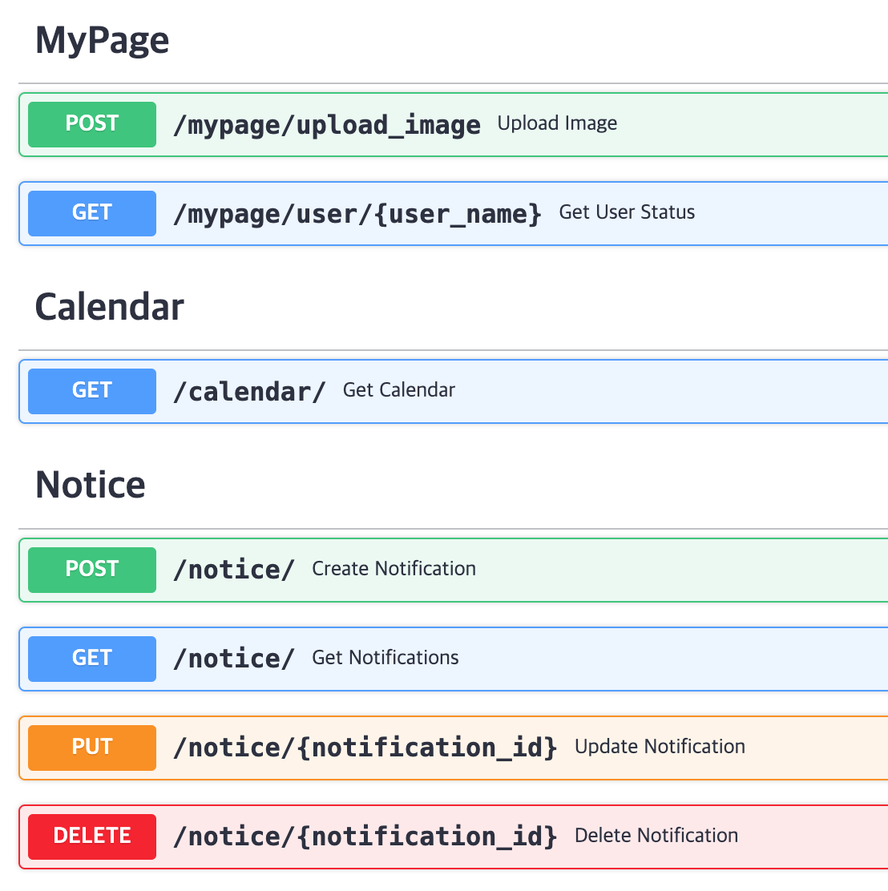

# oow fastapi server
```
python==3.11.0
numpy==1.26.4
```

### tree(09/12)
```bash
.
├── app
│   ├── api # routers
│   │   ├── calendar # 전체 인증 출력
│   │   │   └── calendar.py # Read
│   │   ├── mypage
│   │   │   ├── mypage.py # ocr인증 후 upload, 인증 수, 벌금 출력
│   │   │   └── timecheck
│   │   │       └── ocr.py
│   │   └── notice
│   │       └── notice.py # 공지사항 CRUD, admin만 입력, 수정, 삭제 가능
│   ├── core
│   │   └── config.py # 환경변수 pydantic
│   ├── db
│   │   └── firebase.py # firebase initializers
│   └── main.py
│
├── serviceAccountKey.json # firebase credentials key
├── .env # environment: frontend url
├── .gitignore
├── .docerignore
├── Dockerfile
├── requirements.txt
└── README.md
```

### Test
- root위치에 `.env`, `serviceAccountKey.json`(firebase serviceAccountKey) 있어야함
  ```
  # .env
  FRONTEND_URL="http://{ip}:3000"
  ```
#### 이미지 빌드
```bash
docker build -t [your-image-name] .
```
```
# builded image 
REPOSITORY               TAG       IMAGE ID       CREATED         SIZE
your-image-name          latest    d61c21d4dd75   2 minutes ago   6.2GB
```

#### 컨테이너 실행
```bash
# run image (윈도우면 $(pwd) -> ${PWD} 로 변경)
docker run -p 8000:8000 \
  -n [your-container-name]
  --env-file .env \
  -v $(pwd)/[serviceAccountKey].json:/app/[serviceAccountKey].json:ro \
  [your-image-name]
```
<!--
docker run -p 8000:8000 \
  --name oow-test-container \
  --env-file .env \
  -v $(pwd)/firebase_credentials.json:/app/firebase_credentials.json:ro \
  oow-test
-->

### swagger

